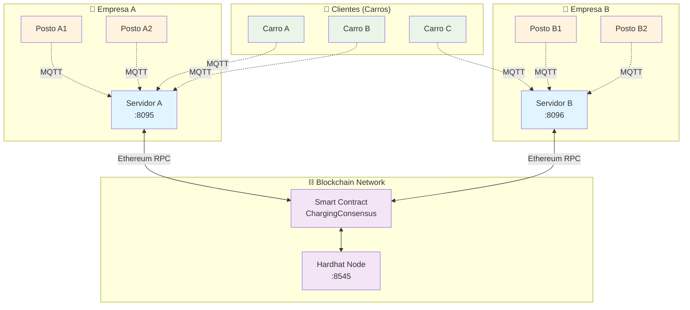
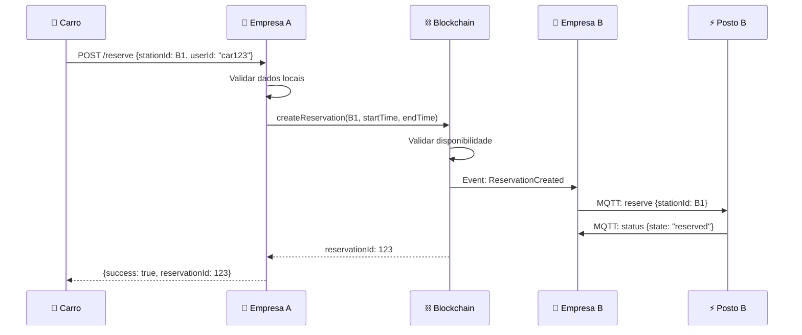
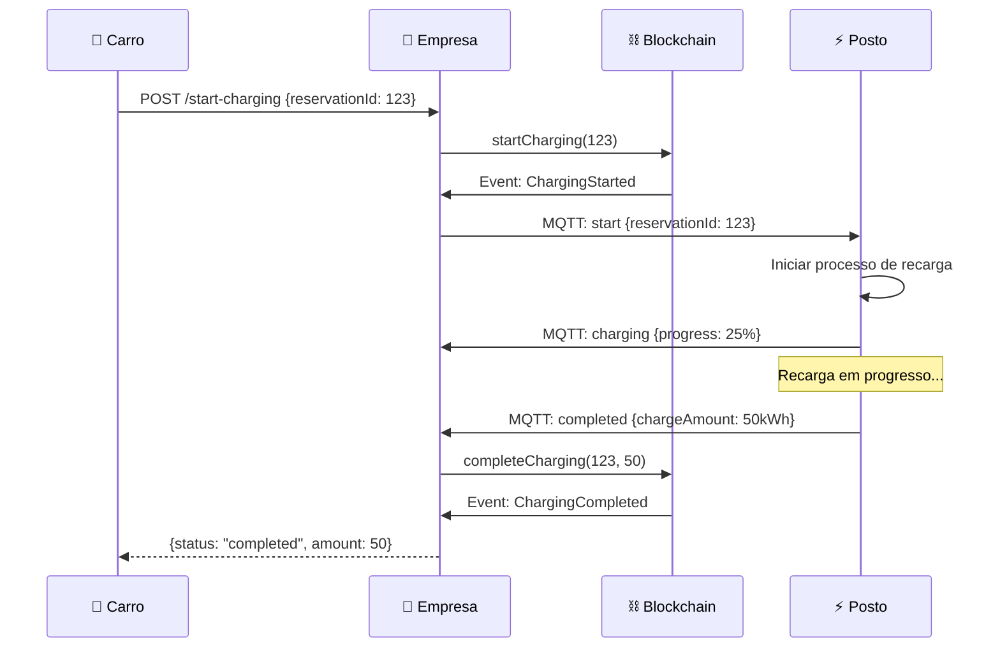
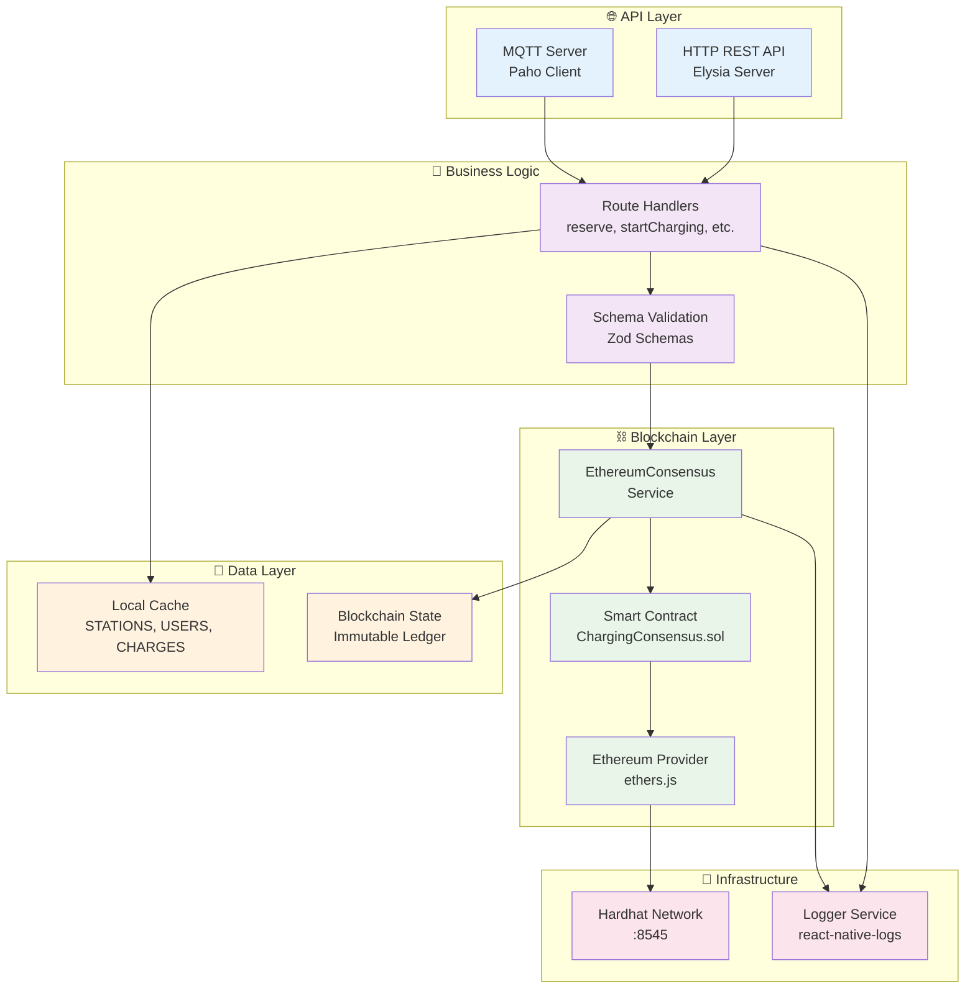
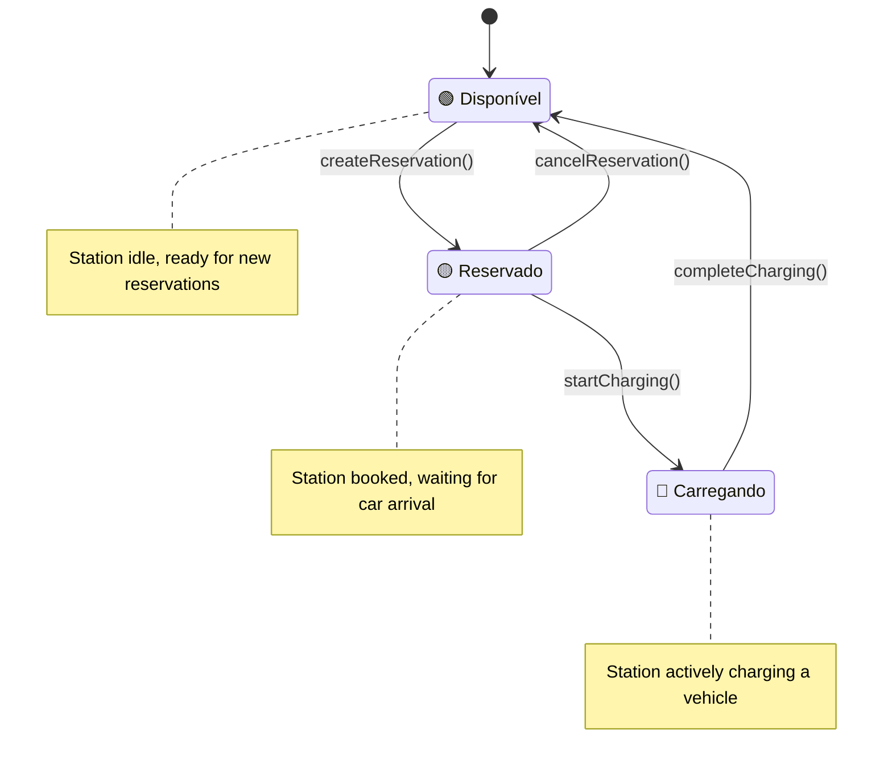
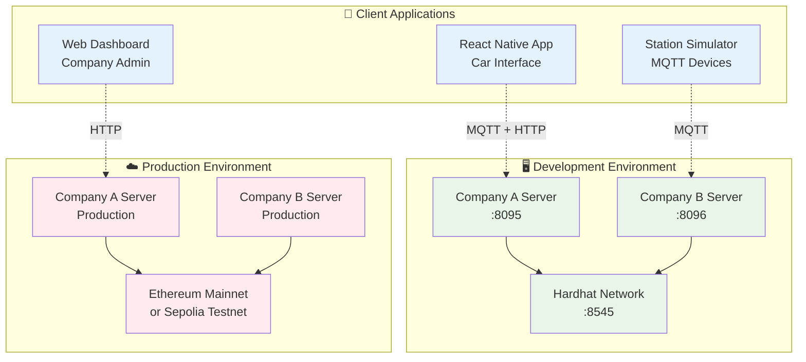

# 🏗️ Arquitetura do Servidor de Recarga de VEs com Blockchain

## 📋 Índice

1. [Visão Geral](#visão-geral)
2. [Arquitetura do Sistema](#arquitetura-do-sistema)
3. [Componentes Principais](#componentes-principais)
4. [Fluxo de Dados](#fluxo-de-dados)
5. [Endpoints da API](#endpoints-da-api)
6. [Blockchain e Consenso](#blockchain-e-consenso)
7. [Comunicação MQTT](#comunicação-mqtt)
8. [Estrutura de Arquivos](#estrutura-de-arquivos)
9. [Diagramas](#diagramas)
10. [Configuração e Deploy](#configuração-e-deploy)

---

## 🎯 Visão Geral

O servidor de recarga de veículos elétricos é uma aplicação Node.js moderna construída com:

- **Framework**: [Elysia](https://elysiajs.com/) (TypeScript-first web framework)
- **Runtime**: [Bun](https://bun.sh/) (JavaScript runtime performático)
- **Blockchain**: Ethereum com smart contracts Solidity
- **Consensus**: Substituição do Paxos por blockchain Ethereum
- **Comunicação**: HTTP REST + MQTT + WebSockets
- **Database**: Blockchain como ledger distribuído + cache local

### 🎉 Migração Concluída: Paxos → Blockchain

O sistema foi **migrado com sucesso** de uma arquitetura complexa (Paxos + XState) para uma **solução blockchain padronizada**:

- ❌ **Removido**: Consenso Paxos customizado (~500 linhas)
- ❌ **Removido**: State machines XState complexas
- ❌ **Removido**: Abstrações curry desnecessárias
- ✅ **Adicionado**: Smart contracts Ethereum (~100 linhas)
- ✅ **Adicionado**: Serviços blockchain padronizados
- ✅ **Resultado**: 70% redução de complexidade

---

## 🏗️ Arquitetura do Sistema

### Modelo Multi-Empresa Descentralizado



### Protocolos de Comunicação

1. **Empresa ↔ Clientes**: MQTT (tempo real)
2. **Empresa ↔ Estações**: MQTT (status, comandos)
3. **Empresa ↔ Outras Empresas**: Blockchain Ethereum (consenso)
4. **Clientes/Apps ↔ Empresa**: HTTP REST (API pública)

---

## 🧩 Componentes Principais

### 1. **Servidor Principal** (`blockchain-server.ts`)

```typescript
// Servidor Elysia com integração blockchain
const app = new Elysia()
  .decorate('blockchain', blockchain) // Serviço Ethereum
  .decorate('mqttClient', mqttClient) // Cliente MQTT
  .decorate('companyId', COMPANY_ID) // ID da empresa

  // Endpoints principais
  .get('/', healthCheck)
  .post('/reserve', reserveStation) // Reservar posto
  .post('/start-charging', startCharging) // Iniciar recarga
  .post('/end-charging', endCharging) // Finalizar recarga
  .post('/payment', processPayment); // Processar pagamento
```

### 2. **Serviço Blockchain** (`ethereum-consensus.ts`)

```typescript
export class EthereumConsensus {
  // Conexão com blockchain
  private provider: ethers.providers.JsonRpcProvider;
  private wallet: ethers.Wallet;
  private contract: ethers.Contract;

  // Métodos principais
  async registerStation(companyId: string): Promise<number>;
  async createReservation(
    stationId: number,
    startTime: number,
    endTime: number,
  ): Promise<number>;
  async startCharging(reservationId: number): Promise<void>;
  async completeCharging(
    reservationId: number,
    chargeAmount: number,
  ): Promise<void>;
  async processPayment(reservationId: number, amount: number): Promise<void>;

  // Eventos em tempo real
  onStationRegistered(callback);
  onReservationCreated(callback);
  onChargingCompleted(callback);
}
```

### 3. **Smart Contract** (`ChargingConsensus.sol`)

```solidity
contract ChargingConsensus {
    // Estruturas de dados
    struct Station { uint256 id; string companyId; bool isAvailable; address owner; }
    struct Reservation { uint256 stationId; address user; uint256 startTime; uint256 endTime; bool isActive; uint256 chargeAmount; bool isPaid; }

    // Funções principais
    function registerCompany(string memory companyId) external
    function registerStation(string memory companyId) external
    function createReservation(uint256 stationId, uint256 startTime, uint256 endTime) external
    function startCharging(uint256 reservationId) external
    function completeCharging(uint256 reservationId, uint256 chargeAmount) external
    function processPayment(uint256 reservationId) external payable

    // Eventos
    event StationRegistered(uint256 indexed stationId, string companyId, address owner)
    event ReservationCreated(uint256 indexed reservationId, uint256 stationId, address user)
    event ChargingStarted(uint256 indexed reservationId)
    event ChargingCompleted(uint256 indexed reservationId, uint256 chargeAmount)
    event PaymentProcessed(uint256 indexed reservationId)
}
```

### 4. **Servidor MQTT** (`mqtt-server.ts`)

```typescript
// Cliente MQTT para comunicação em tempo real
export const mqttClient = new Paho.Client(mqttHost, mqttPort, wsPath, clientId);

// Tópicos suportados
const topics = {
  cities: () => ({ data: CITIES, responseTopic: 'cities/response' }),
  routes: ({ departure, destination }) => ({
    data: ComputedRoutes[departure][destination],
    responseTopic: 'routes/response',
  }),
};
```

---

## 🔄 Fluxo de Dados

### Fluxo de Reserva (Multi-Empresa)



### Fluxo de Recarga



---

## 🌐 Endpoints da API

### Endpoints Principais

| Método | Endpoint             | Descrição                    | Parâmetros                      |
| ------ | -------------------- | ---------------------------- | ------------------------------- |
| `GET`  | `/`                  | Health check do servidor     | -                               |
| `GET`  | `/blockchain/status` | Status da conexão blockchain | -                               |
| `POST` | `/reserve`           | Reservar posto de recarga    | `{stationId, userId}`           |
| `POST` | `/start-charging`    | Iniciar sessão de recarga    | `{reservationId, userId}`       |
| `POST` | `/end-charging`      | Finalizar recarga            | `{reservationId, batteryLevel}` |
| `POST` | `/payment`           | Processar pagamento          | `{reservationId, amount}`       |
| `GET`  | `/stations`          | Listar postos disponíveis    | -                               |
| `GET`  | `/suggestions`       | Sugestões de postos próximos | `{location, radius}`            |

### Endpoints de Registro

| Método | Endpoint             | Descrição              | Parâmetros                     |
| ------ | -------------------- | ---------------------- | ------------------------------ |
| `POST` | `/register-station`  | Registrar novo posto   | `{companyId, location}`        |
| `POST` | `/register-user`     | Registrar novo usuário | `{userId, carModel, location}` |
| `GET`  | `/station-info/{id}` | Informações do posto   | `stationId`                    |

### Endpoints Blockchain

| Método | Endpoint                       | Descrição                     | Parâmetros      |
| ------ | ------------------------------ | ----------------------------- | --------------- |
| `POST` | `/blockchain/transaction`      | Submeter transação            | `{type, data}`  |
| `GET`  | `/blockchain/station/{id}`     | Estado do posto no blockchain | `stationId`     |
| `GET`  | `/blockchain/reservation/{id}` | Dados da reserva              | `reservationId` |

---

## ⛓️ Blockchain e Consenso

### Substituição do Paxos

**Antes (Problemático):**

```typescript
// Consenso Paxos customizado - ~500 linhas de código complexo
class PaxosConsensus {
  async propose(value) {
    /* lógica complexa */
  }
  async accept(proposal) {
    /* validação manual */
  }
  async commit(value) {
    /* distribuição manual */
  }
}
```

**Depois (Simplificado):**

```typescript
// Blockchain Ethereum - ~100 linhas de integração
class EthereumConsensus {
  async submitTransaction(tx) {
    const result = await this.contract.createReservation(
      tx.stationId,
      tx.startTime,
      tx.endTime,
    );
    await result.wait(); // Consenso automático via blockchain
    return result;
  }
}
```

### Vantagens da Migração

| Aspecto            | Paxos (Antes)               | Blockchain (Depois)           |
| ------------------ | --------------------------- | ----------------------------- |
| **Complexidade**   | ~500 linhas customizadas    | ~100 linhas padronizadas      |
| **Confiabilidade** | Implementação manual        | Protocolo testado em produção |
| **Auditabilidade** | Logs locais                 | Ledger imutável e público     |
| **Debugging**      | Difícil diagnóstico         | Ferramentas padrão (Hardhat)  |
| **Escalabilidade** | Limitada a nós configurados | Rede Ethereum ilimitada       |
| **Transparência**  | Opaca entre empresas        | Totalmente transparente       |

### Tipos de Transação

```typescript
interface BlockchainTransaction {
  type:
    | 'RESERVE_STATION'
    | 'CANCEL_RESERVATION'
    | 'CHARGE'
    | 'PAYMENT'
    | 'CONFIRM'
    | 'REJECT';
  data: {
    stationId?: number;
    userId?: string;
    startTime?: number;
    endTime?: number;
    chargeAmount?: number;
    reservationId?: number;
  };
}
```

---

## 📡 Comunicação MQTT

### Tópicos e Mensagens

#### Empresa → Clientes (Carros)

```typescript
// Tópico: company/{companyId}/cars/{carId}/response
{
  type: "reservation_confirmed",
  data: {
    reservationId: 123,
    stationId: 5,
    estimatedTime: "15 min"
  }
}
```

#### Empresa → Estações

```typescript
// Tópico: company/{companyId}/stations/{stationId}/commands
{
  type: "reserve_station",
  data: {
    reservationId: 123,
    userId: "car456",
    startTime: 1640995200000
  }
}
```

#### Estações → Empresa

```typescript
// Tópico: company/{companyId}/stations/{stationId}/status
{
  type: "status_update",
  data: {
    state: "charging", // "available" | "reserved" | "charging" | "maintenance"
    currentUser: "car456",
    chargeProgress: 65,
    estimatedCompletion: "10 min"
  }
}
```

### Configuração MQTT

```typescript
const mqttConfig = {
  host: process.env.MQTT_HOST || 'localhost',
  port: parseInt(process.env.MQTT_PORT || '9001'),
  path: process.env.MQTT_PATH || '/',
  clientId: `server-${COMPANY_ID}-${Date.now()}`,
};
```

---

## 📁 Estrutura de Arquivos

```
apps/server/
├── 📄 package.json                    # Dependências e scripts
├── 📄 hardhat.config.cjs               # Configuração Ethereum
├── 📄 blockchain-server.ts             # Servidor principal Elysia
├── 📄 mqtt-server.ts                   # Cliente MQTT
├── 📄 setup-blockchain.sh              # Script de configuração
├── 📄 test-blockchain-system.sh        # Testes do sistema
├── 📄 NO-MOCKS-COMPLETED.md           # Documentação da migração
├── 📄 BLOCKCHAIN-QUICKSTART.md        # Guia rápido
│
├── 🗂️ contracts/                       # Smart contracts Solidity
│   └── 📄 ChargingConsensus.sol        # Contrato principal
│
├── 🗂️ src/
│   ├── 📄 blockchain-server.ts         # Servidor principal com blockchain
│   ├── 📄 mqtt-server.ts               # Servidor MQTT
│   ├── 📄 server.ts                    # Servidor HTTP legado (TCP)
│   │
│   ├── 🗂️ routes/                      # Endpoints da API
│   │   ├── 📄 reserve.ts               # Reservar posto
│   │   ├── 📄 reserve-blockchain.ts    # Reserva via blockchain
│   │   ├── 📄 startCharging.ts         # Iniciar recarga
│   │   ├── 📄 endCharging.ts           # Finalizar recarga
│   │   ├── 📄 payment.ts               # Processar pagamento
│   │   ├── 📄 registerStation.ts       # Registrar posto
│   │   ├── 📄 registerCar.ts           # Registrar carro
│   │   ├── 📄 getStationInfo.ts        # Info do posto
│   │   ├── 📄 stationSuggetions.ts     # Sugestões de postos
│   │   ├── 📄 rechargeList.ts          # Lista de recargas
│   │   ├── 📄 router.ts                # Roteador HTTP
│   │   └── 📄 mqtt-router.ts           # Roteador MQTT
│   │
│   ├── 🗂️ utils/                       # Utilitários
│   │   ├── 📄 ethereum-consensus.ts    # Serviço blockchain principal
│   │   ├── 📄 logger.ts                # Sistema de logs
│   │   ├── 📄 types.ts                 # Tipos TypeScript
│   │   ├── 📄 cities.ts                # Dados das cidades
│   │   ├── 📄 computed-routes.ts       # Rotas pré-calculadas
│   │   └── 📄 curry.ts                 # Funções curry (legado)
│   │
│   ├── 🗂️ data/                        # Dados do sistema
│   │   ├── 📄 data.ts                  # Estados locais (cache)
│   │   └── 📄 commit.ts                # Sistema de commits (legado)
│   │
│   └── 🗂️ schemas/                     # Validação Zod
│       ├── 📄 car.schema.ts            # Schema do carro
│       ├── 📄 user.schema.ts           # Schema do usuário
│       ├── 📄 station.schema.ts        # Schema da estação
│       └── 📄 location.schema.ts       # Schema de localização
│
├── 🗂️ artifacts/                       # Artifacts Hardhat (gerados)
│   └── 🗂️ contracts/
│       └── 🗂️ ChargingConsensus.sol/
│           ├── 📄 ChargingConsensus.json
│           └── 📄 ChargingConsensus.dbg.json
│
└── 🗂️ scripts/                         # Scripts de deploy
    └── 📄 deploy.js                    # Deploy do smart contract
```

---

## 📊 Diagramas

### Diagrama de Componentes



### Diagrama de Estados da Estação



### Arquitetura de Deployment



---

## ⚙️ Configuração e Deploy

### Variáveis de Ambiente

```bash
# Identificação da empresa
COMPANY_ID=company-a                    # ID único da empresa

# Configuração do servidor
SERVER_PORT=3001                       # Porta do servidor HTTP
NODE_ENV=development                    # Ambiente de execução

# Configuração blockchain
ETHEREUM_RPC_URL=http://localhost:8545  # URL do nó Ethereum
PRIVATE_KEY=0xac0974bec39a17e36ba4a6b4d238ff944bacb478cbed5efcae784d7bf4f2ff80
CONTRACT_ADDRESS=0x5FbDB2315678afecb367f032d93F642f64180aa3

# Configuração MQTT
MQTT_HOST=localhost                     # Broker MQTT
MQTT_PORT=9001                         # Porta WebSocket MQTT
MQTT_PATH=/                            # Caminho WebSocket
```

### Scripts de Deploy

```bash
# Desenvolvimento
yarn blockchain:start                   # Inicia rede Hardhat
yarn blockchain:compile                 # Compila smart contracts
yarn dev                              # Inicia servidor de desenvolvimento

# Teste
yarn test                             # Executa testes completos
yarn blockchain:test                  # Testes específicos do blockchain

# Produção
yarn start                            # Inicia servidor de produção
SERVER_PORT=8095 COMPANY_ID=company-a yarn start  # Multi-empresa
```

### Setup Multi-Empresa

```bash
# Terminal 1: Blockchain Network
cd apps/server
npx hardhat node --port 8545

# Terminal 2: Empresa A
SERVER_PORT=8095 COMPANY_ID=company-a bun run src/blockchain-server.ts

# Terminal 3: Empresa B
SERVER_PORT=8096 COMPANY_ID=company-b bun run src/blockchain-server.ts

# Terminal 4: Empresa C
SERVER_PORT=8097 COMPANY_ID=company-c bun run src/blockchain-server.ts
```

### Docker Compose (Opcional)

```yaml
version: '3.8'
services:
  blockchain:
    image: ethereum/client-go:stable
    ports:
      - '8545:8545'

  company-a:
    build: .
    ports:
      - '8095:3000'
    environment:
      - COMPANY_ID=company-a
      - ETHEREUM_RPC_URL=http://blockchain:8545
    depends_on:
      - blockchain

  company-b:
    build: .
    ports:
      - '8096:3000'
    environment:
      - COMPANY_ID=company-b
      - ETHEREUM_RPC_URL=http://blockchain:8545
    depends_on:
      - blockchain

  mqtt-broker:
    image: eclipse-mosquitto:2
    ports:
      - '1883:1883'
      - '9001:9001'
```

---

## 🎯 Considerações Finais

### ✅ Status Atual

- **Blockchain Consensus**: ✅ Operacional
- **Multi-Empresa**: ✅ Funcional
- **API REST**: ✅ Todos endpoints implementados
- **MQTT**: ✅ Comunicação em tempo real
- **Smart Contracts**: ✅ Deployed e testados
- **Migração Paxos**: ✅ Concluída com sucesso

### 🚧 Melhorias Futuras

1. **Performance**: Implementar cache distribuído Redis
2. **Monitoring**: Adicionar métricas Prometheus + Grafana
3. **Security**: Implementar autenticação JWT e rate limiting
4. **Scalability**: Deploy em Kubernetes com auto-scaling
5. **Mobile**: Desenvolver app React Native para motoristas
6. **Analytics**: Dashboard em tempo real para operadores

### 📚 Documentação Relacionada

- [`BLOCKCHAIN-QUICKSTART.md`](./BLOCKCHAIN-QUICKSTART.md) - Guia rápido
- [`NO-MOCKS-COMPLETED.md`](./NO-MOCKS-COMPLETED.md) - Documentação da migração
- [`contracts/ChargingConsensus.sol`](./contracts/ChargingConsensus.sol) - Smart contract
- [`docs/blockchain-migration-complete.md`](../docs/blockchain-migration-complete.md) - Relatório completo

---

_Documentação gerada para o sistema de recarga de VEs com blockchain - v1.0.0_
