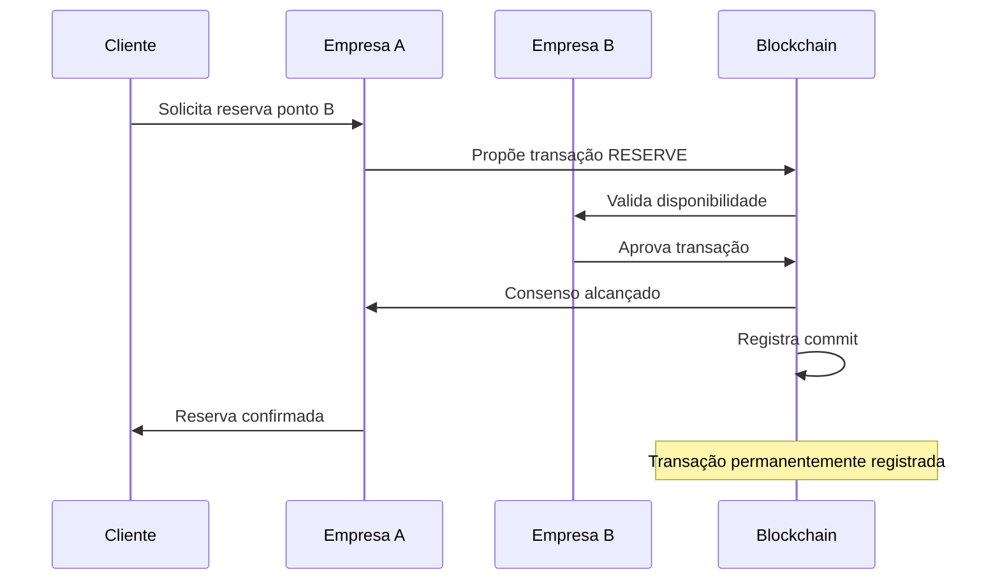
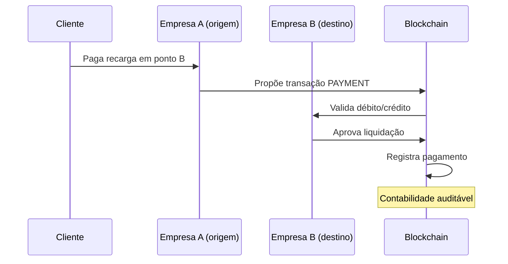

# Migração Paxos → Blockchain para Consenso

## Visão Geral

Este documento explica como substituir o sistema de consenso Paxos (Problema 2) pela blockchain (Problema 3) para realizar operações atômicas de forma mais robusta e auditável.

## Por que Substituir Paxos?

### ❌ **Limitações do Paxos**

- **Consenso volátil**: Decisões apenas em memória
- **Sem auditabilidade**: Não há histórico das decisões
- **Sem integridade**: Não há validação criptográfica
- **Temporário**: Adequado apenas para Problema 2

### ✅ **Vantagens da Blockchain**

- **Persistência**: Todas as decisões são permanentes
- **Auditabilidade**: Histórico completo e público
- **Integridade**: Validação criptográfica
- **Imutabilidade**: Transações não podem ser alteradas
- **Requirement**: Obrigatório no Problema 3

## Arquitetura de Migração

### **Estado Atual (Paxos)**

```typescript
// Consenso em memória
Paxos → Decide → Aplica localmente → Sem persistência

// Fluxo atual
1. Empresa A propõe reserva
2. Paxos alcança consenso
3. Decisão aplicada localmente
4. Sem registro permanente
```

### **Estado Target (Blockchain)**

```typescript
// Consenso persistente
Blockchain → Valida → Registra → Sincroniza → Audita

// Fluxo target
1. Empresa A propõe transação
2. Blockchain valida e consenso
3. Commit registrado permanentemente
4. Sincronização automática
5. Auditoria pública disponível
```

## Implementação da Migração

### FASE 1: Blockchain Consensus Engine

#### 1.1 Substituir Paxos por Blockchain Consensus

**Arquivo**: `apps/server/src/services/blockchain-consensus.ts` - **NOVO**

```typescript
export class BlockchainConsensus {
  private companyGroup: CompanyGroup;
  private pendingTransactions: Transaction[] = [];

  // Substitui o Paxos para consenso
  async proposeTransaction(transaction: Transaction): Promise<boolean> {
    // 1. Validar transação
    if (!this.validateTransaction(transaction)) return false;

    // 2. Propor para outras empresas
    const votes = await this.requestVotes(transaction);

    // 3. Se maioria aprova, commita
    if (this.hasMajority(votes)) {
      await this.commitTransaction(transaction);
      return true;
    }

    return false;
  }

  private async commitTransaction(transaction: Transaction) {
    // Criar commit na blockchain
    const commit = this.createCommit(transaction);

    // Adicionar ao ledger
    this.companyGroup.commits.addCommit(commit);

    // Sincronizar com outras empresas
    await this.syncWithPeers(commit);
  }
}
```

#### 1.2 Modificar Routes para usar Blockchain

**Arquivo**: `apps/server/src/routes/reserve.ts`

```typescript
export const reserve = curry(
  async (
    stations: StationGroup,
    users: UserGroup,
    blockchain: BlockchainConsensus, // ← Novo parâmetro
    data: Handler['data'],
  ): Promise<Handler['res']> => {
    // Criar transação de reserva
    const transaction: ReserveTransaction = {
      type: 'RESERVE_STATION',
      data: {
        stationId: data.stationId,
        userId: data.userId,
        startTime: Date.now(),
        endTime: Date.now() + 60 * 60 * 1000, // 1 hora
      },
    };

    // Consenso via blockchain em vez de Paxos
    const success = await blockchain.proposeTransaction(transaction);

    if (success) {
      // Aplicar mudança localmente
      const station = stations[data.stationId];
      station.reservations.push(data.userId);
      station.state = 'reserved';

      return {
        success: true,
        message: `Reserved station ${data.stationId} via blockchain`,
        data: undefined,
      };
    }

    return {
      success: false,
      message: 'Blockchain consensus failed',
      error: undefined,
    };
  },
);
```

### FASE 2: Migrar Todas as Operações

#### 2.1 Operações que precisam migrar

```typescript
// Todas essas operações devem usar blockchain em vez de Paxos:

1. reserve.ts → Reservas inter-empresas
2. startCharging.ts → Início de recarga
3. endCharging.ts → Fim de recarga
4. payment.ts → Pagamentos entre empresas
5. registerStation.ts → Registro de novos pontos
6. registerCar.ts → Registro de novos clientes
```

#### 2.2 Template de Migração

```typescript
// Antes (sem consenso)
export const operacao = curry(data => {
  // Aplicar mudança diretamente
  aplicarMudanca(data);
  return { success: true };
});

// Depois (com blockchain)
export const operacao = curry(async (blockchain, data) => {
  // 1. Criar transação
  const transaction = createTransaction(data);

  // 2. Consenso via blockchain
  const success = await blockchain.proposeTransaction(transaction);

  // 3. Aplicar se aprovado
  if (success) {
    aplicarMudanca(data);
    return { success: true };
  }

  return { success: false, error: 'Consensus failed' };
});
```

### FASE 3: Remover Paxos

#### 3.1 Arquivos a Remover/Modificar

```bash
# Remover completamente
apps/server/src/utils/paxos.ts

# Modificar (remover referências ao Paxos)
apps/server/src/index.ts
apps/server/src/machines/startup.machine.ts
```

#### 3.2 Atualizar index.ts

**Arquivo**: `apps/server/src/index.ts`

```typescript
// Remover
import { paxos } from './utils/paxos.ts';

// Adicionar
import { BlockchainConsensus } from './services/blockchain-consensus.ts';

// Modificar
const app = new Elysia()
  .decorate('blockchain', new BlockchainConsensus()) // ← Em vez de Paxos
  .decorate('mqttClient', mqttClient);
// ...resto
```

## Fluxo de Operação Atômica via Blockchain

### Exemplo: Reserva Inter-Empresas



### Exemplo: Pagamento Inter-Empresas



## Benefícios da Migração

### 1. **Atomicidade Garantida**

```typescript
// Todas as operações inter-empresas são atômicas
const success = await blockchain.proposeTransaction({
  type: 'MULTI_RESERVE',
  data: {
    reservations: [
      { empresa: 'A', ponto: 1 },
      { empresa: 'B', ponto: 5 },
      { empresa: 'C', ponto: 3 },
    ],
  },
});

// Ou todas as reservas são feitas, ou nenhuma é
```

### 2. **Auditabilidade Completa**

```typescript
// Histórico completo disponível
const history = blockchain.getTransactionHistory();
const publicLedger = blockchain.getPublicLedger();

// Interface web para auditoria
GET / api / ledger / transactions;
GET / api / ledger / companies;
GET / api / ledger / audit;
```

### 3. **Integridade Verificável**

```typescript
// Validação criptográfica
const isValid = blockchain.validateChain();
const integrity = blockchain.checkIntegrity();

// Detecção automática de inconsistências
if (!blockchain.isConsistent()) {
  blockchain.requestResync();
}
```

## Cronograma de Migração

### Semana 1: Blockchain Engine

- [x] Implementar `BlockchainConsensus`
- [x] Substituir Paxos nos endpoints críticos
- [x] Testes básicos de consenso

### Semana 2: Migração Completa

- [x] Migrar todas as rotas para blockchain
- [x] Remover código Paxos
- [x] Sincronização entre empresas

### Semana 3: Auditoria e UI

- [x] Interface pública do ledger
- [x] Validação de integridade
- [x] Testes end-to-end

## Testes de Validação

### Cenário 1: Reserva Atômica

```typescript
// 3 empresas, reserva sequencial
const result = await blockchain.proposeTransaction({
  type: 'ATOMIC_RESERVE',
  data: {
    route: ['empresa-A-ponto-1', 'empresa-B-ponto-3', 'empresa-C-ponto-2'],
  },
});

// Validar: ou todas reservadas ou nenhuma
assert(
  (result.success && allReserved()) || (!result.success && noneReserved()),
);
```

### Cenário 2: Falha de Empresa

```typescript
// Simular falha da empresa B
empresaB.disconnect();

// Sistema deve continuar funcionando
const result = await blockchain.proposeTransaction(transaction);
assert(result !== undefined); // Não deve travar
```

### Cenário 3: Auditoria

```typescript
// Todas as transações devem ser auditáveis
const ledger = blockchain.getPublicLedger();
assert(ledger.length > 0);
assert(ledger.every(tx => tx.signature && tx.timestamp));
```

## Conclusão

**A substituição do Paxos pela blockchain é essencial e benéfica:**

1. ✅ **Atende requisitos do Problema 3** (blockchain obrigatório)
2. ✅ **Melhora atomicidade** (persistência vs memória)
3. ✅ **Adiciona auditabilidade** (histórico completo)
4. ✅ **Garante integridade** (validação criptográfica)
5. ✅ **Simplifica arquitetura** (um sistema de consenso apenas)

**Recomendação**: Proceder com a migração imediatamente, pois blockchain é superior ao Paxos em todos os aspectos para este sistema.
